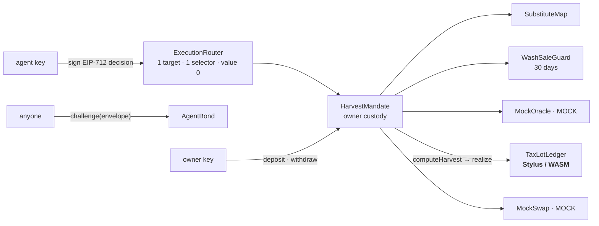

<div align="center">
  
  <h1>HarvestBot</h1>
  <p><em>An agent that harvests tax losses on Robinhood tokenized equities — bounded by an onchain mandate it cannot exceed, and slashed when it lies.</em></p>
  <p>
    
  </p>

  [](JUDGE.md)
  [](DEMO.md)
  [](bench/RESULTS.md)
  [](https://www.hackquest.io/hackathons/Arbitrum-Open-House-Singapore-Online-Buildathon)

  
  
  
  
  
  [](https://github.com/edycutjong/harvestbot/actions/workflows/ci.yml)
  [](LICENSE)
</div>

---

## ✅ Verification

Every row is on chain **46630 (Robinhood Chain testnet)** and every hash is a live explorer link. The agent key and the owner key are different keys.

| | |
|---|---|
| **Tests** | **80** Foundry (`forge test`) — 100 % line · 100 % function · 98.3 % statement · 89.2 % branch coverage on `src/` (`make coverage`), 3 fuzz properties, regression tests named for the defect they pin · **6** Stylus native (`cargo test`) |
| **Static analysis** | Slither **0 high · 0 medium** — every remaining finding triaged in [`docs/SLITHER.md`](docs/SLITHER.md) · `forge fmt` · `cargo clippy -D warnings` |
| **Killer number** | 64-lot HIFO harvest: **Solidity 1,456,905 gas → Stylus 507,993 gas — 2.87× less L2 compute** (3.1× at 128 lots; grows with portfolio size), same chain, same inputs, identical output ([bench](bench/RESULTS.md)) |
| **Beat 1 · HARVEST** | [`0x689c4d34…6123`](https://explorer.testnet.chain.robinhood.com/tx/0x689c4d345c492c08ef06aed9341de941cb131835cce52886d700207925f26123) — agent-signed, router-gated, HIFO recomputed on the Stylus ledger, **−$24.531251** realized on 9 lots, real AMZN → real NFLX |
| **Beat 2 · BLOCKED REBUY** | [`0xd486468e…cf10`](https://explorer.testnet.chain.robinhood.com/tx/0xd486468ea84c6d419b28401386ce832483f809f96a35ea94e9c4a92037fecf10) — **reverted on chain**, `WashSaleViolation` |
| **Beat 3 · SLASHED** | attempt [`0x7dca0680…0bf6`](https://explorer.testnet.chain.robinhood.com/tx/0x7dca068071e91ca95b992d62eb3096ec465b8bae8fd939f1baf426902d990bf6) reverted `OffMapSubstitute` → challenge [`0xcceb12a7…6493`](https://explorer.testnet.chain.robinhood.com/tx/0xcceb12a766ef6c8f4e861f9c7ac6f30cb495044f5032cec3fec4127c87066493) — bond **1,000 → 800 mUSDC** (this run's challenger was the owner's key; `challenge` is permissionless and tested with a third party) |

| Contract | Address | Kind |
|---|---|---|
| `TaxLotLedger` | [`0xEff7…5a21`](https://explorer.testnet.chain.robinhood.com/address/0xEff7B46049fC677F58264e0ebb19dF1a39195a21) | **Stylus (Rust → WASM)** — [deploy](https://explorer.testnet.chain.robinhood.com/tx/0x5cc682a744a69537987990b58c7884313c315fa7cf22998986b4fbe0dac177ed) |
| `HarvestMandate` | [`0x15FD…a6E2`](https://explorer.testnet.chain.robinhood.com/address/0x15FDF1F8A537ea7e660C9867b3e5e66B0996a6E2) | Solidity |
| `AgentBond` | [`0x822f…0736`](https://explorer.testnet.chain.robinhood.com/address/0x822fAC45a881801955b3130076A58790bBb40736) | Solidity — deployed build predates the 2026-09-27 hardening in source ([details](docs/ARCHITECTURE.md#deployed-build-vs-source)) |
| `ExecutionRouter` | [`0x2a12…19aE`](https://explorer.testnet.chain.robinhood.com/address/0x2a121714bEA2B69154521aEba9C5039C500c19aE) | Solidity |
| `WashSaleGuard` | [`0x1A98…A29C`](https://explorer.testnet.chain.robinhood.com/address/0x1A98594aA8dC627b34b586756833bbe508B0A29C) | Solidity |
| `SubstituteMap` | [`0x1e8D…7CfE`](https://explorer.testnet.chain.robinhood.com/address/0x1e8Df64A7B17490dcDd4E03E695Cb1E766A37CfE) | Solidity |
| `MockOracle` · `MockSwap` · `MockUSDC` | [`0xBaDD…2598`](https://explorer.testnet.chain.robinhood.com/address/0xBaDD49e6f6665Bdc90AE21EC2AAA22fD8cf52598) · [`0xFd7f…9E6a`](https://explorer.testnet.chain.robinhood.com/address/0xFd7f7A2beE5F1DC47A59691bF023948567969E6a) · [`0x0E8A…3f89`](https://explorer.testnet.chain.robinhood.com/address/0x0E8A996DBD141352fA10940ae8045C323dC03f89) | **MOCK**, labeled |
| Assets | AMZN `0x5884…9E02` · NFLX `0x3b82…8C93` · PLTR `0x1FBE…98d0` | **real** Robinhood testnet Stock Tokens (faucet) |

Deployer/owner `0x72cd…557b` · agent `0xF783…457E` · all addresses in [`deployments/46630.json`](deployments/46630.json), all receipts in [`receipts/46630.json`](receipts/46630.json).

---

## 💡 The problem

In December, Maya sees her tokenized-equity position down $3,140 on paper and does nothing — because banking that loss *properly* means picking which of 64 tax lots to sell, then policing a 30-day calendar so she doesn't trip the wash-sale rule and void the deduction. Wealthfront and Betterment sell exactly this service ("direct indexing") for 0.25 %/yr. On chain, where Robinhood now issues tokenized stocks, **none of the plumbing exists**: no cost-basis ledger, no specific-lot identification, no wash-sale enforcement — and no safe way to hand the job to an agent.

**HarvestBot** is that plumbing, with the agent bounded by contracts instead of by trust:

- 📒 **Onchain HIFO tax-lot ledger** — a Stylus (WASM) contract records every lot, selects the highest-basis lots for a sale, prorates the last one, and computes the realized loss deterministically. The compute-heavy part lives in Rust because that is where WASM beats EVM opcodes — 2.87× less L2 gas at 64 lots, measured, not asserted ([bench](bench/RESULTS.md)).
- 🧱 **Contract-enforced wash-sale rule** — after a harvest, any rebuy of the same or a substantially-identical asset **reverts** for 30 days. The agent cannot route around it; the chain says no.
- 🔐 **A mandate the agent cannot exceed** — the agent's key can call exactly one function through a router; the mandate re-verifies signature, nonce, deadline, substitute map, wash-sale window, HIFO selection *and* realized loss at the oracle mark before anything moves. No path exists from the agent key to a withdrawal.
- ⚖️ **A slashable bond** — anyone holding an envelope the agent signed that the mandate must reject can slash it: 20 % of the bond, 10 % of that to the challenger, the rest to the owner. Being wrong costs the agent more than it can ever gain.

## 🎬 The demo, in three beats

| | Beat | What happens on chain |
|---|---|---|
| 1 | **HARVEST** | Agent signs the HIFO picks → router → mandate recomputes them on the Stylus ledger → real AMZN rotates into real NFLX, loss realized, window opened |
| 2 | **BLOCKED REBUY** | Same agent tries to rotate back into AMZN → `WashSaleViolation`, transaction reverted **by the contract** |
| 3 | **SLASHED** | Agent signs an off-map rotation into PLTR → reverted → anyone submits the signed envelope to `challenge()` → bond slashed, bounty paid |

Numbers, hashes, and the reproduce commands: [`DEMO.md`](DEMO.md). The 30-second version: [`JUDGE.md`](JUDGE.md).

## 🏗️ Architecture



| Layer | Choice | Why |
|---|---|---|
| Ledger | **Rust → WASM on Arbitrum Stylus** (`stylus/ledger`) | HIFO over 64 lots is a compute loop; WASM is cheaper per instruction than EVM — measured, not asserted |
| Ledger twin | Solidity (`contracts/src/TaxLotLedger.sol`) | Same ABI, same integer semantics; the benchmark control and the fallback for non-Stylus chains |
| Mandate · router · guard · map · bond | Solidity 0.8.28 + OpenZeppelin 5.4 | `Ownable`, `SafeERC20`, `ReentrancyGuard`, `EIP712`, `ECDSA` |
| Assets | Robinhood testnet Stock Tokens | Real faucet tokens (AMZN/NFLX/PLTR), 18-dp ERC-20s |
| Oracle · swap · bond token | MOCK contracts, labeled | No Stock-Token AMM or USDC exists on the testnet |

Seven invariants (INV-1 custody … INV-7 determinism) each have a named test — [`docs/ARCHITECTURE.md`](docs/ARCHITECTURE.md).

## 🏆 Why only Arbitrum + Robinhood Chain

- **`cargo stylus deploy` → WASM contract on Robinhood Chain.** The ledger is not Solidity. `ArbWasm.stylusVersion() = 3` on chain 46630; the deploy tx above is the single `cargo stylus deploy` transaction. Remove Stylus and the HIFO scan costs 2.87× more L2 gas at 64 lots, 3.1× at 128 — measured on chain 46630 with the program *uncached* (the testnet has no ArbOS cache manager yet), so these are worst-case Stylus numbers.
- **Robinhood Stock Tokens are the asset.** The mandate holds `0x5884…9E02` (AMZN) and `0x3b82…8C93` (NFLX) from the official faucet — a tokenized-equity tax ledger only makes sense on the chain that issues tokenized equities.
- **Arbitrum precompiles as a capability probe.** `cast call 0x…71 'stylusVersion()'` answered the "is WASM live on this Orbit chain?" question in one RPC call, before any code was written ([DX report](docs/DX-REPORT.md)).
- **Honest limitation:** there is no Stock-Token AMM on the testnet, so the rotation executes through a labeled MOCK fixed-rate venue at the oracle mark. The tokens are real; the venue is not.
- **Scope of the wash-sale rule:** the contract walls re-buys for the 30 days *after* a harvest; the IRS look-back (a purchase in the 30 days *before* the loss sale) is not yet enforced. This and the other known limits are listed in [`docs/ARCHITECTURE.md`](docs/ARCHITECTURE.md#known-limitations-by-design-or-deferred).

## 🚀 Run it

```bash
git clone --recurse-submodules https://github.com/edycutjong/harvestbot && cd harvestbot
cd contracts && forge test                     # 80 tests, incl. exactly −$3,140.000000 on the seed scenario
cd ../stylus/ledger && cargo test              # 6 native tests on the WASM engine

# live, read-only, no wallet — ask the deployed Stylus ledger for Maya's HIFO picks
cast call 0xEff7B46049fC677F58264e0ebb19dF1a39195a21 \
  'computeHarvest(address,address,uint256,uint256)(uint64[],int256)' \
  0x72cd3cB98A5d9B830b386EeBA7B2340132Ba557b 0x5884aD2f920c162CFBbACc88C9C51AA75eC09E02 638501157098660213 412300000 \
  --rpc-url https://rpc.testnet.chain.robinhood.com
# → the NEXT nine HIFO lots, [55, 54, …, 47]: beat 1 already sold lots 63–56 and part of 55 —
#   its own picks [63, …, 55] and −24531251 are in that tx's HarvestReport event
```

Your own deploy (testnet key + faucet ETH, see [`.env.example`](.env.example)): `forge script script/Deploy.s.sol` → `cargo stylus deploy` → `scripts/seed.sh` → `scripts/beats.sh` → `python3 scripts/bench.py`.

## 🧪 Testing & CI

`make ci` = `forge fmt --check` · `forge test` · `forge coverage` · `cargo fmt/clippy/test` · Slither. GitHub Actions: Solidity + Stylus quality gates, Slither SARIF, TruffleHog, gitleaks over full history, CodeQL, Dependabot, tagged releases from conventional commits.

| Category | Where | What it proves |
|---|---|---|
| Three beats end-to-end | `Mandate.t.sol`, `Bond.t.sol` | the demo, deterministically |
| Invariants INV-1…INV-6 | `Mandate.t.sol`, `Router.t.sol`, `WashSale.t.sol` | custody, loss integrity, wash-sale monotonicity, on-map, authenticity, bond dominance |
| Fuzz properties | `testFuzz_*` (3) | HIFO never worse than lowest-basis-first · window is exactly 30 days for any timestamps · breach is negative-EV for any bond |
| Regressions named for the defect | e.g. `test_reenabling_a_disabled_pair_does_not_duplicate_it_in_substitutesOf` | found and fixed during the build |
| Engine equivalence | `bench/results.json` (`lotIds` + `realizedLoss` identical at every size) | INV-7 |

## 📁 Layout

```
contracts/      Foundry — src/ (6 contracts + 4 labeled mocks), test/ (80), script/ (Deploy, Seed, Envelope)
stylus/ledger/  Rust — the Stylus TaxLotLedger (+ stylus/spike, the day-0 activation receipt)
scripts/        seed.sh · beats.sh · bench.py · check_submission_readiness.py   (cast-driven: forge cannot simulate WASM)
deployments/    46630.json (the system) · 46630-bench.json (bench ledgers)
receipts/       46630.json (the three beats) · envelopes/*.hex (the signed decisions, incl. the rogue one)
bench/          results.json · RESULTS.md
docs/           ARCHITECTURE.md · DX-REPORT.md · SLITHER.md · assets/
DEMO.md · JUDGE.md
```

## 📄 License

[MIT](LICENSE) © 2026 Edy Cu

## 🙏 Acknowledgments

Built solo for the Arbitrum Open House Singapore Online Buildathon (HackQuest, Sept 2026). Thank you to Offchain Labs for Stylus and `cargo-stylus`, to Robinhood for a testnet faucet that hands out real Stock Tokens, and to the judges for their time reviewing this project.
